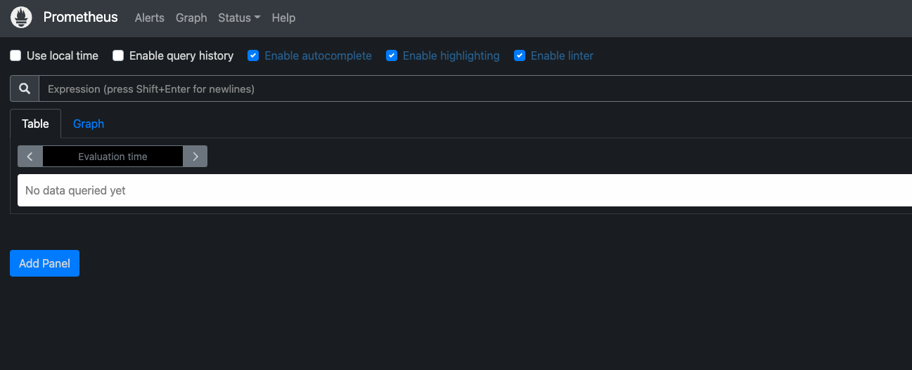
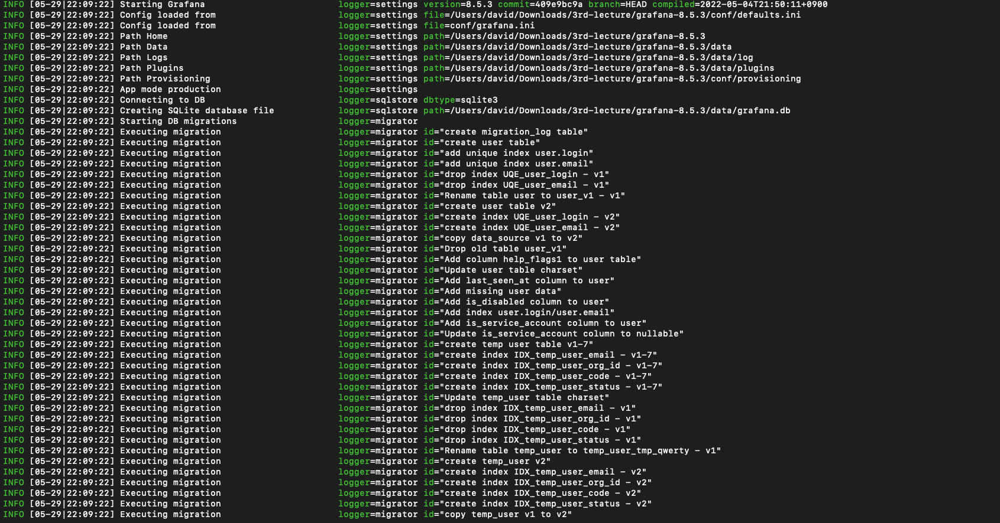
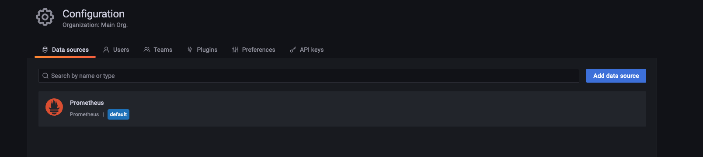
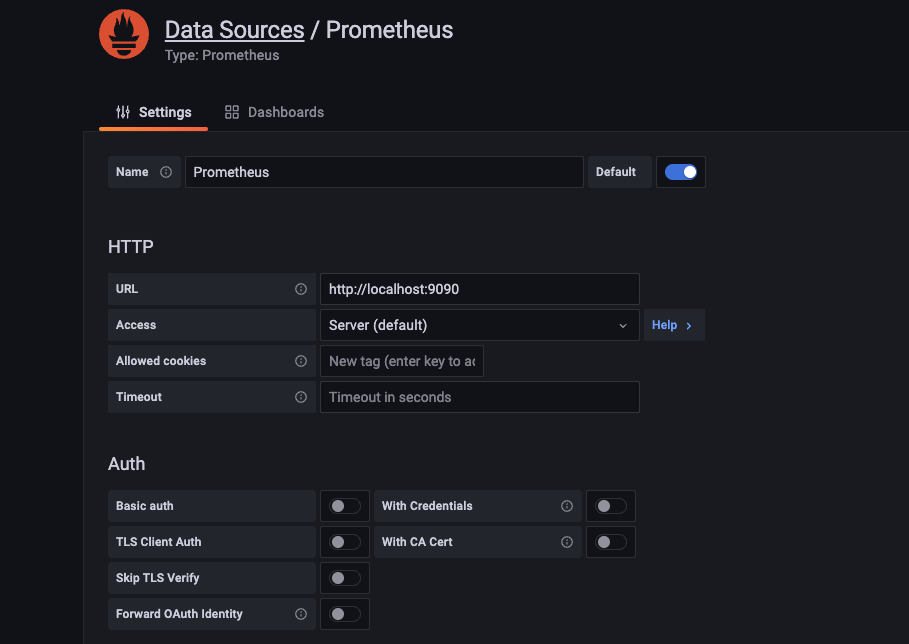
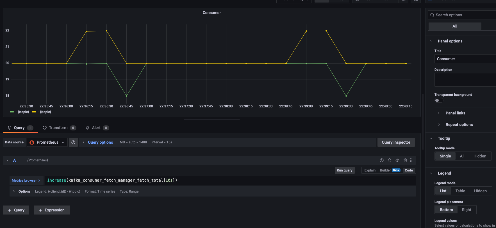
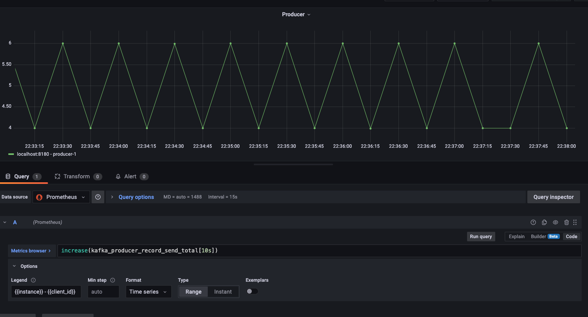

## 실행 환경 설정
> 4가지 서버 구동 필요
> - zookeeper
> - kafka
> - prometheus
> - grafana
```shell
# 1번 터미널 : zookeeper 실행
cd apache-zookeeper-3.8.0-bin
bin/zkServer.sh start-foreground

# 2번 터미널 : kafka 실행
cd kafka_2.13-3.2.0
bin/kafka-server-start.sh config/server.properties

# 3번 터미널 : prometheus 실행
cd prometheus-2.36.0-rc0.darwin-amd64
./prometheus --config.file=prometheus.yml

# 4번 터미널 : grafana 실행
cd grafana-8.5.3
bin/grafana-server --config conf/grafana.ini
```

## 프로메테우스
- url : https://prometheus.io/download/ 
```shell
# 프로메테우스 실행
./prometheus --config.file=prometheus.yml
```

> localhost:9090
 
> 현재 서버와 매핑되어 있지 않음

```yaml
# prometheus.yml 파일 수정
scrape_configs:
  # The job name is added as a label `job=<job_name>` to any timeseries scraped from this config.
  - job_name: "prometheus"

    # metrics_path defaults to '/metrics'
    # scheme defaults to 'http'.

    static_configs:
      - targets: ["localhost:9090"]

  - job_name: "actuator_prometheus"
    metrics_path: "/actuator/prometheus"
    scrape_interval: 5s
    static_configs:
      - targets: ["localhost:8180"]

```
> 아래와 같이 kafka_producer와 같은 목록이 추가됨 
>
>

# Grafana
- prometheus 보다 시각화된 자료를 활용하기 위해서 사용함
- url : https://grafana.com/grafana/download       
```shell
# grafana 실행
cd conf
cp defaults.ini grafana.ini

bin/grafana-server --config conf/grafana.ini
```
> 
> URL : localhost:3000<br>
> 최초 계정  ID:admin / PW:admin
> 
> 
> 
 

> ## Grafana Dashboard
> ### consumer
> 
> 
> ### producer
> 