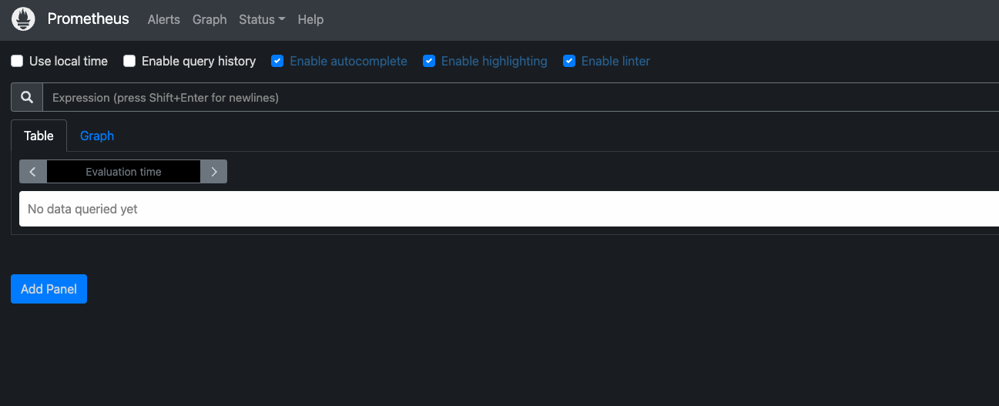
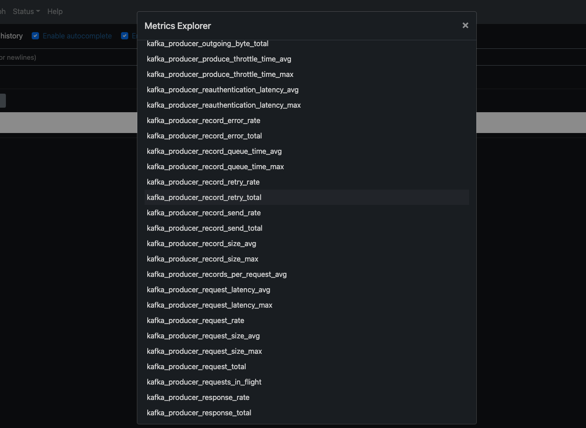

https://prometheus.io/download/

```shell
# 프로메테우스 실행
./prometheus --config.file=prometheus.yml
```

> chrome 창에서 localhost:9090으로 접속
 
> 현재 서버와 매핑되어 있지 않음

```yaml
# prometheus.yml 파일 수정
scrape_configs:
  # The job name is added as a label `job=<job_name>` to any timeseries scraped from this config.
  - job_name: "prometheus"

    # metrics_path defaults to '/metrics'
    # scheme defaults to 'http'.

    static_configs:
      - targets: ["localhost:9090"]

  - job_name: "actuator_prometheus"
    metrics_path: "/actuator/prometheus"
    scrape_interval: 5s
    static_configs:
      - targets: ["localhost:8180"]

```
> 아래와 같이 kafka_producer와 같은 목록이 추가됨 
>
